# CANTILEVER_SHEAR_APP

  
  
  
  
  
  
  
  
  

## Workflow

1. **[`GeometryProc`](https://github.com/nuremics/sim-labs/tree/cantilever-shear/src/nuremics_labs/apps/simulation/CANTILEVER_SHEAR_APP/procs/GeometryProc):** Create a geometric representation of a physical system. 
  A/ **`create_geometry`:** Create and export a simple geometric entity (1D line, 2D rectangle or 3D box) in BREP format.
2. **[`LabelingProc`](https://github.com/nuremics/sim-labs/tree/cantilever-shear/src/nuremics_labs/apps/simulation/CANTILEVER_SHEAR_APP/procs/LabelingProc):** Define and label the entities of a physical system from its geometric representation. 
  A/ **`label_entities`:** Assign labels to the entities of a geometric model.
3. **[`MeshProc`](https://github.com/nuremics/sim-labs/tree/cantilever-shear/src/nuremics_labs/apps/simulation/CANTILEVER_SHEAR_APP/procs/MeshProc):** Discretize the geometric representation of a physical system into a computational mesh. 
  A/ **`generate_mesh`:** Generate and export a computational mesh from a geometric model by discretizing the domain into mesh entities (nodes, elements) and assigning labeled physical groups.
4. **[`ModelProc`](https://github.com/nuremics/sim-labs/tree/cantilever-shear/src/nuremics_labs/apps/simulation/CANTILEVER_SHEAR_APP/procs/ModelProc):** Convert a meshed geometry into a model object mapping geometric labels to mesh entities. 
  A/ **`build_model`:** Build a VTK-based model object from a meshed geometry by creating data fields that map physical groups to their corresponding nodes and elements.
5. **[`SolverProc`](https://github.com/nuremics/sim-labs/tree/cantilever-shear/src/nuremics_labs/apps/simulation/CANTILEVER_SHEAR_APP/procs/SolverProc):** Compute the mechanical deformation of a physical system under prescribed boundary conditions. 
  A/ **`run_solver`:** Define the simulation setup, apply boundary conditions, and execute the solver to compute the raw simulation results. 
  B/ **`compile_solution`:** Compile the raw simulation results into a PVD format and compute the displacement field over the model.
6. **[`PostProc`](https://github.com/nuremics/sim-labs/tree/cantilever-shear/src/nuremics_labs/apps/simulation/CANTILEVER_SHEAR_APP/procs/PostProc):** Post-process simulation results to extract relevant metrics. 
  A/ **`get_deflection`:** Extract the displacement at the extremity of the object from raw simulation results and save it to a metric data file. 
  B/ **`plot_deflection`:** Plot the displacement metric over time.
7. **[`AnalysisProc`](https://github.com/nuremics/sim-labs/tree/cantilever-shear/src/nuremics_labs/apps/simulation/CANTILEVER_SHEAR_APP/procs/AnalysisProc):** Analyze the results of multiple simulation runs to identify trends, compare metrics, and draw conclusions. 
  A/ **`plot_overall`:** Visualize and compare the metrics of the various simulation runs on a single plot. 
  B/ **`summarize_overall_errors`:** Compile and summarize the deviations between computed simulation results and reference solutions for all performed tests.

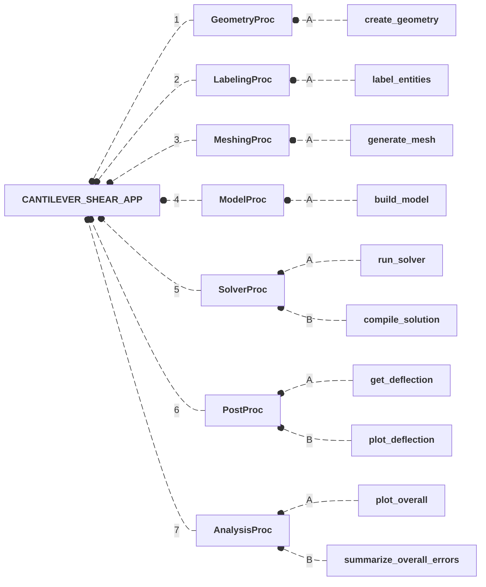

## Mapping

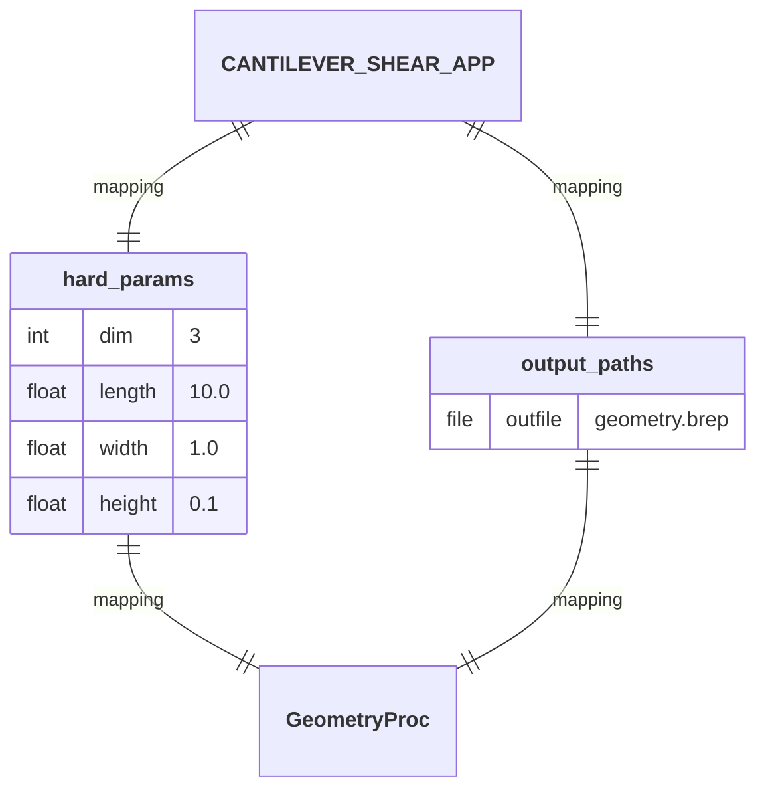

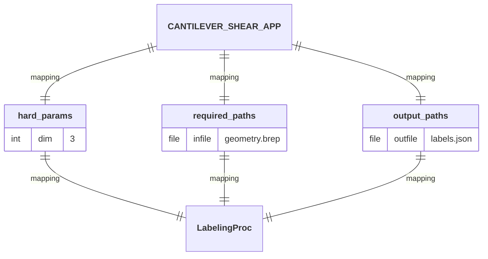

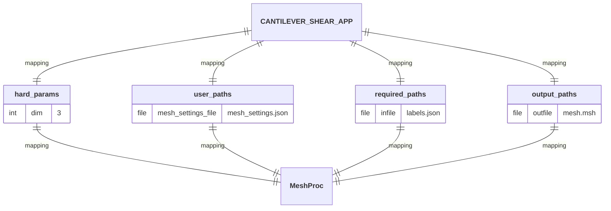

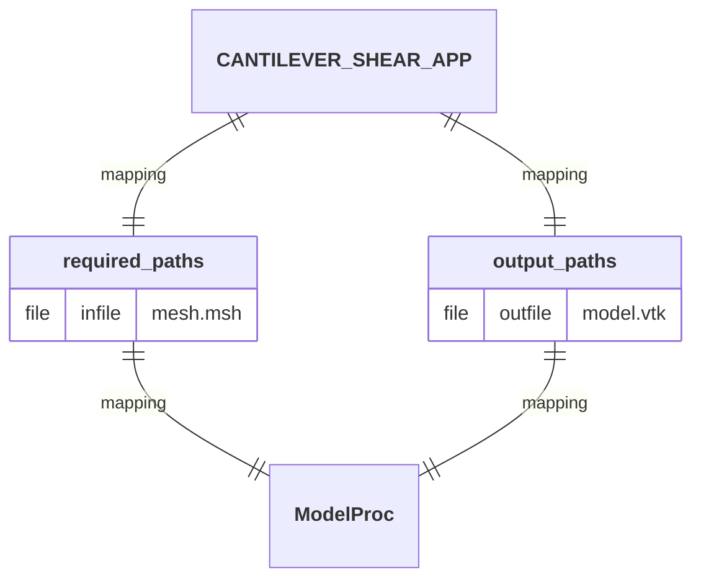

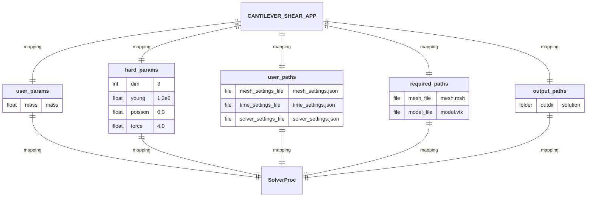

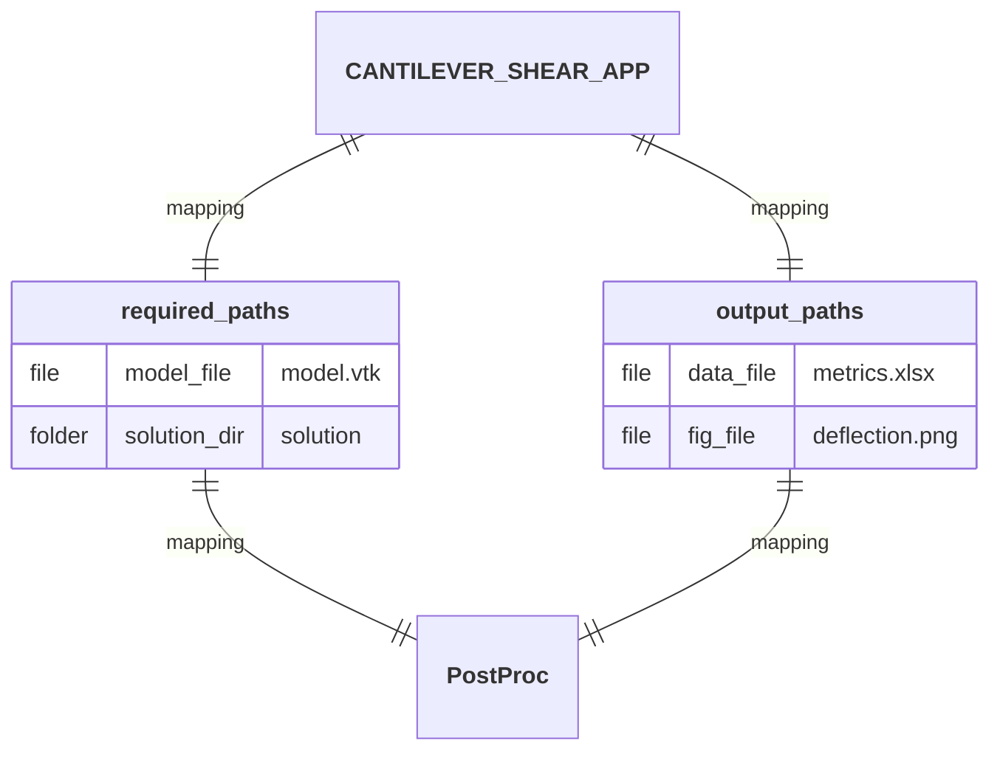

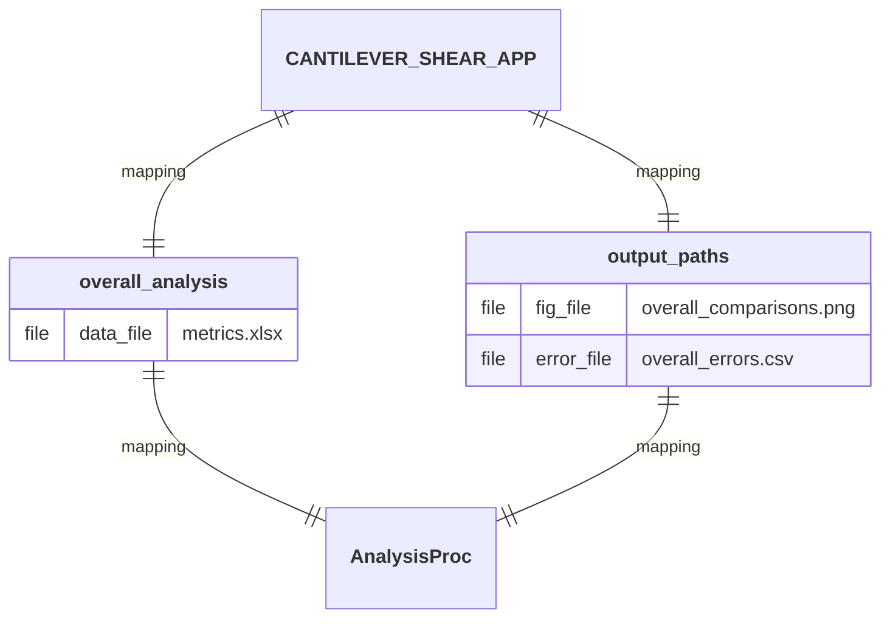

## I/O Interface

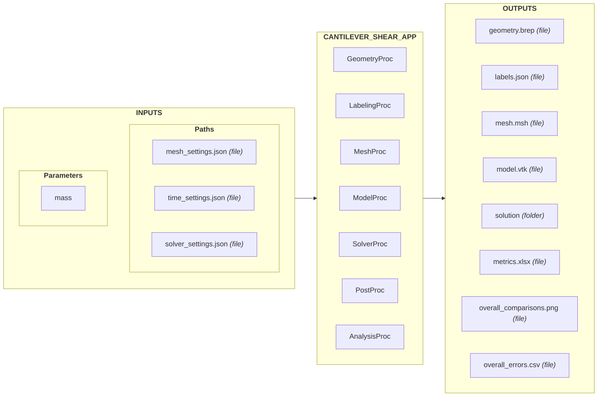

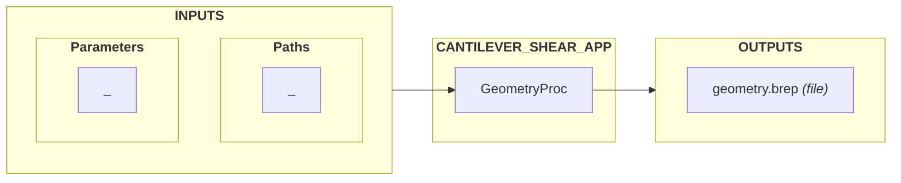

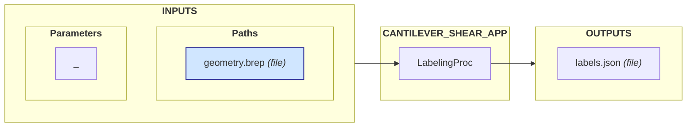

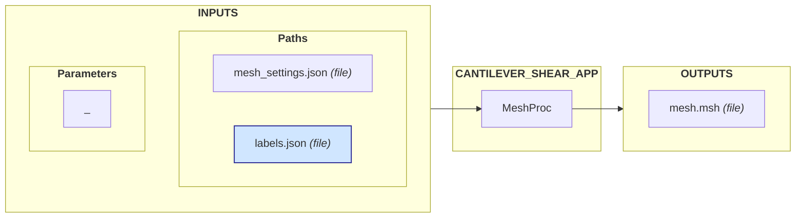

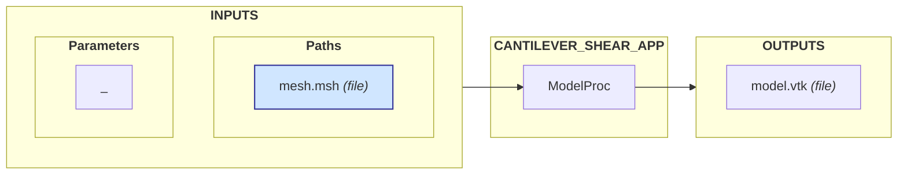

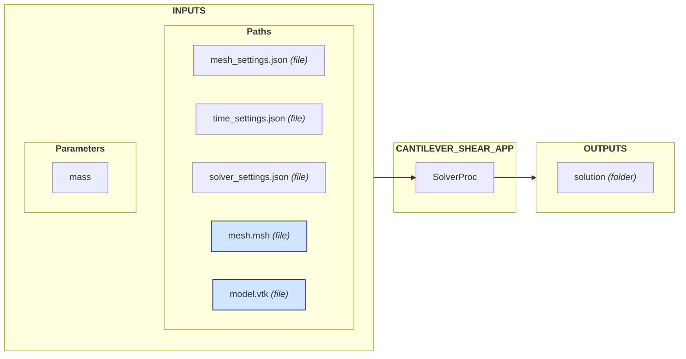

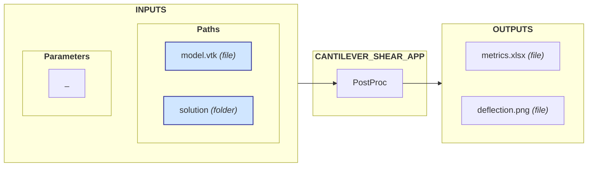

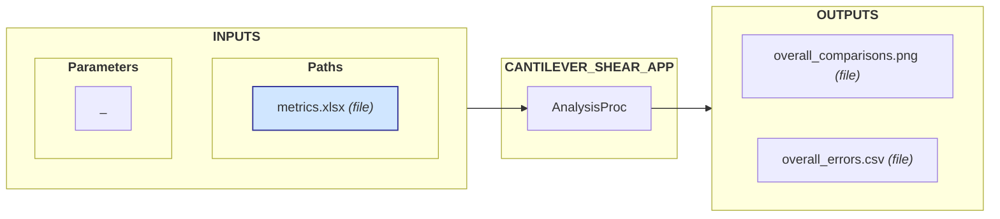

### INPUTS

#### Parameters

- **`mass`:** Mass of the material.

#### Paths

- **`mesh_settings.json`:** File containing the mesh discretization settings.
- **`time_settings.json`:** File containing the time settings.
- **`solver_settings.json`:** File containing the solver settings.

### OUTPUTS

- **`geometry.brep`:** File containing the geometric model.
- **`labels.json`:** File containing the labeled geometric entities.
- **`mesh.msh`:** File containing the computational mesh (exported in Gmsh format).
- **`model.vtk`:** File containing the model object.
- **`solution`:** Directory containing the simulation results.
- **`metrics.xlsx`:** File containing the computed displacement metric.
- **`deflection.png`:** File containing the visual representation of the displacement metric.
- **`overall_comparisons.png`:** File containing the visual comparisons of the metrics for the various simulation runs.
- **`overall_errors.csv`:** File summarizing the obtained errors across all simulation runs.