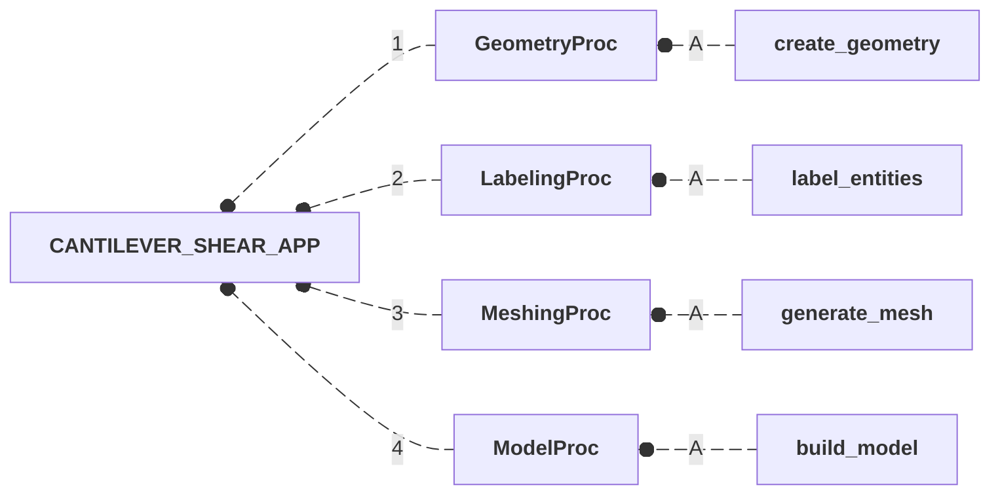
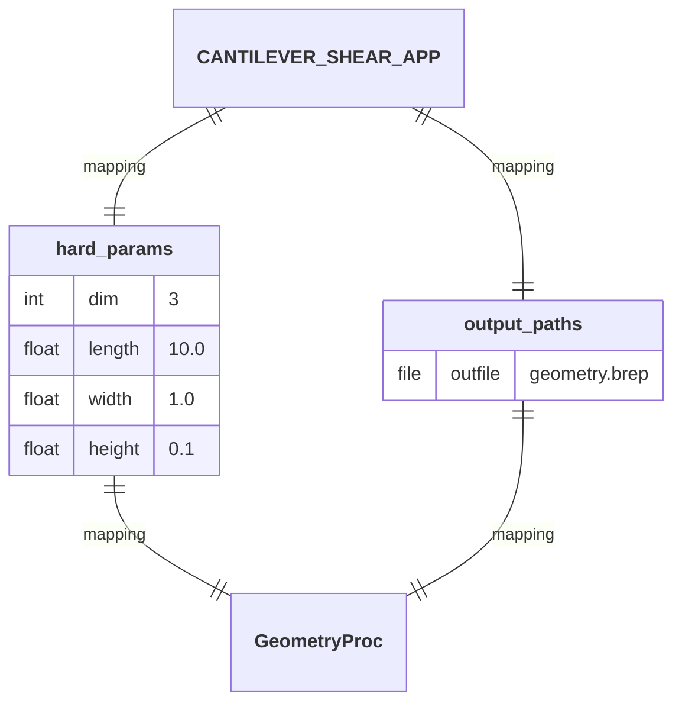
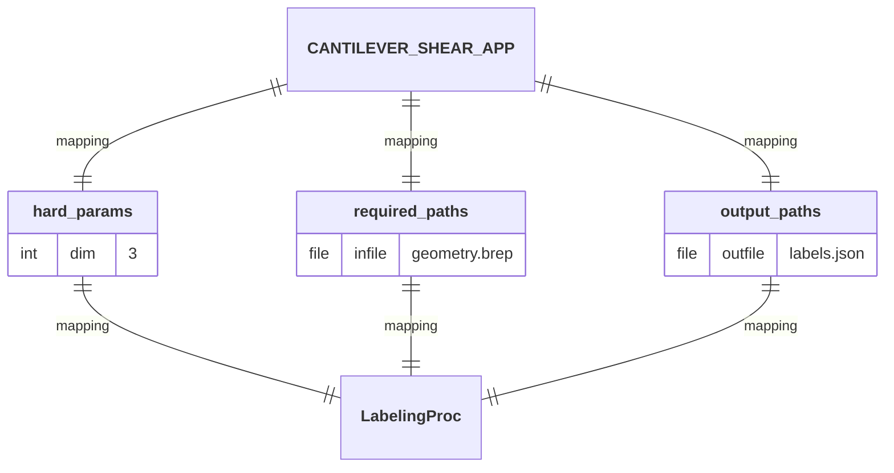
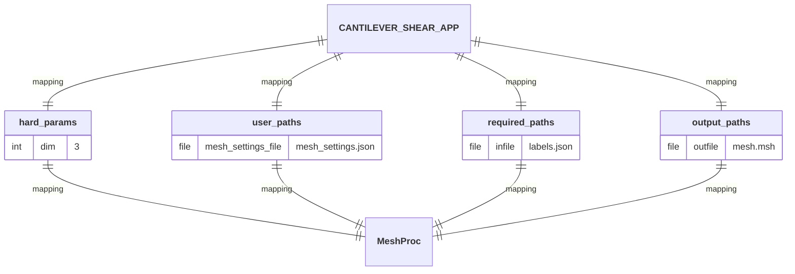
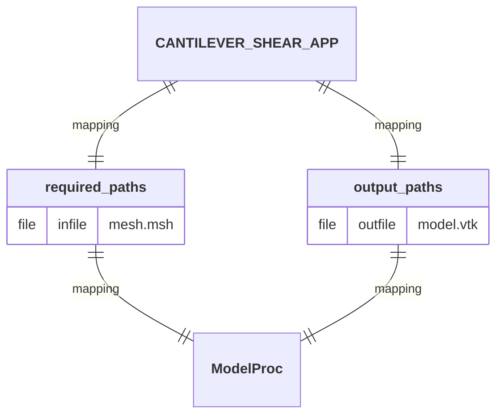
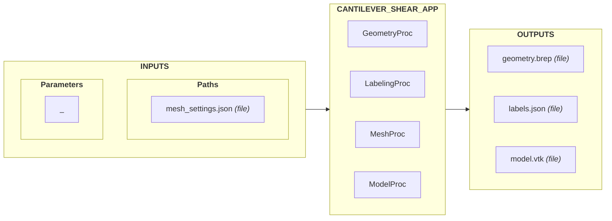
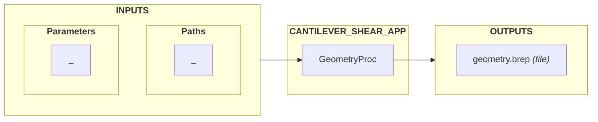
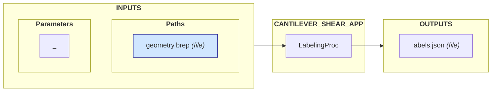
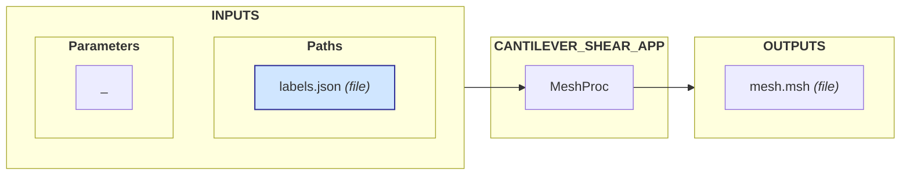
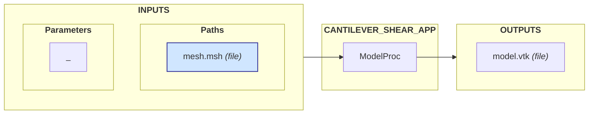

# CANTILEVER_SHEAR_APP

  
  
  
  
  

## Workflow

1. **[`GeometryProc`](https://github.com/nuremics/sim-labs/tree/cantilever-shear/src/nuremics_labs/apps/simulation/CANTILEVER_SHEAR_APP/procs/GeometryProc):** Create a geometric representation of a physical system. 
  A/ **`create_geometry`:** Create and export a simple geometric entity (1D line, 2D rectangle or 3D box) in BREP format.
2. **[`LabelingProc`](https://github.com/nuremics/sim-labs/tree/cantilever-shear/src/nuremics_labs/apps/simulation/CANTILEVER_SHEAR_APP/procs/LabelingProc):** Define and label the entities of a physical system from its geometric representation. 
  A/ **`label_entities`:** Assign labels to the entities of a geometric model.
3. **[`MeshProc`](https://github.com/nuremics/sim-labs/tree/cantilever-shear/src/nuremics_labs/apps/simulation/CANTILEVER_SHEAR_APP/procs/MeshProc):** Discretize the geometric representation of a physical system into a computational mesh. 
  A/ **`generate_mesh`:** Generate and export a computational mesh from a geometric model by discretizing the domain into mesh entities (nodes, elements) and assigning labeled physical groups.
4. **[`ModelProc`](https://github.com/nuremics/sim-labs/tree/cantilever-shear/src/nuremics_labs/apps/simulation/CANTILEVER_SHEAR_APP/procs/ModelProc):** Convert a meshed geometry into a model object mapping geometric labels to mesh entities. 
  A/ **`build_model`:** Build a VTK-based model object from a meshed geometry by creating data fields that map physical groups to their corresponding nodes and elements.

## Mapping

## I/O Interface

### INPUTS

#### Parameters

NA

<!-- - **`dimension`:** Dimension of the geometry (`1` for a 1D line, `2` for a 2D rectangle, `3` for a 3D box). -->

#### Paths

- **`mesh_settings.json`:** File containing the mesh discretization settings.

### OUTPUTS

- **`geometry.brep`:** File containing the geometric model.
- **`labels.json`:** File containing the labeled geometric entities.
- **`mesh.msh`:** File containing the computational mesh (exported in Gmsh format).
- **`model.vtk`:** File containing the model object.