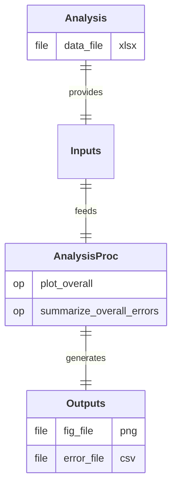

# AnalysisProc

  
  
  

## Process

Analyze the results of multiple simulation runs to identify trends, compare metrics, and draw conclusions. 
A/ **`plot_overall`:** Visualize and compare the metrics of the various simulation runs on a single plot. 
B/ **`summarize_overall_errors`:** Compile and summarize the deviations between computed simulation results and reference solutions for all performed tests.

## Input Analysis

- **`data_file`:** File containing the computed displacement metric.

## Output Path(s)

- **`fig_file`:** File containing the visual comparisons of the metrics for the various simulation runs.
- **`error_file`:** File summarizing the obtained errors across all simulation runs.