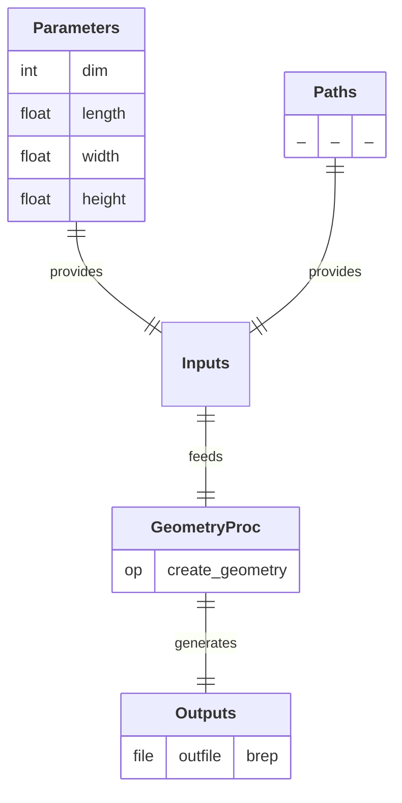

# GeometryProc

  

## Process

Create a geometric representation of a physical system. 
A/ **`create_geometry`:** Create and export a simple geometric entity (1D line, 2D rectangle or 3D box) in BREP format.

## Input Parameter(s)

- **`dim`:** Dimension of the geometry: 1 for a 1D line, 2 for a 2D rectangle, 3 for a 3D box.
- **`length`:** Length of the geometry along the X axis.
- **`width`:** Width of the geometry along the Y axis (only used if dim = 2|3).
- **`height`:** Height of the geometry along the Z axis (only used if dim = 3).

## Output Path(s)

- **`outfile`:** File containing the geometric model.