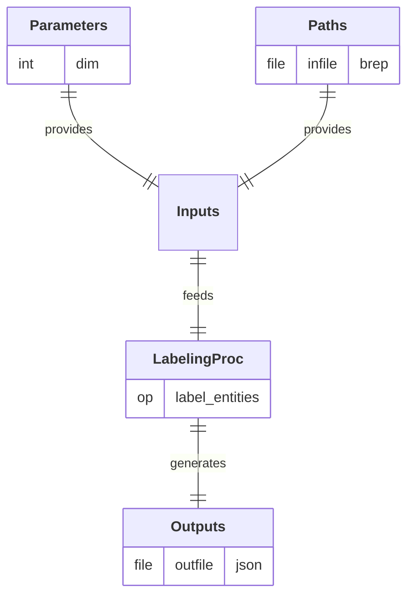

# LabelingProc

## Process

Define and label the entities of a physical system from its geometric representation. 
A/ **`label_entities`:** Assign labels to the entities of a geometric model.

## Input Parameter(s)

- **`dim`:** Dimension of the geometry: 1 for a 1D line (beam), 2 for a 2D surface (plate), 3 for a 3D volume (solid).

## Input Path(s)

- **`infile`:** File containing the geometric model.

## Output Path(s)

- **`outfile`:** File containing the labeled geometric entities.