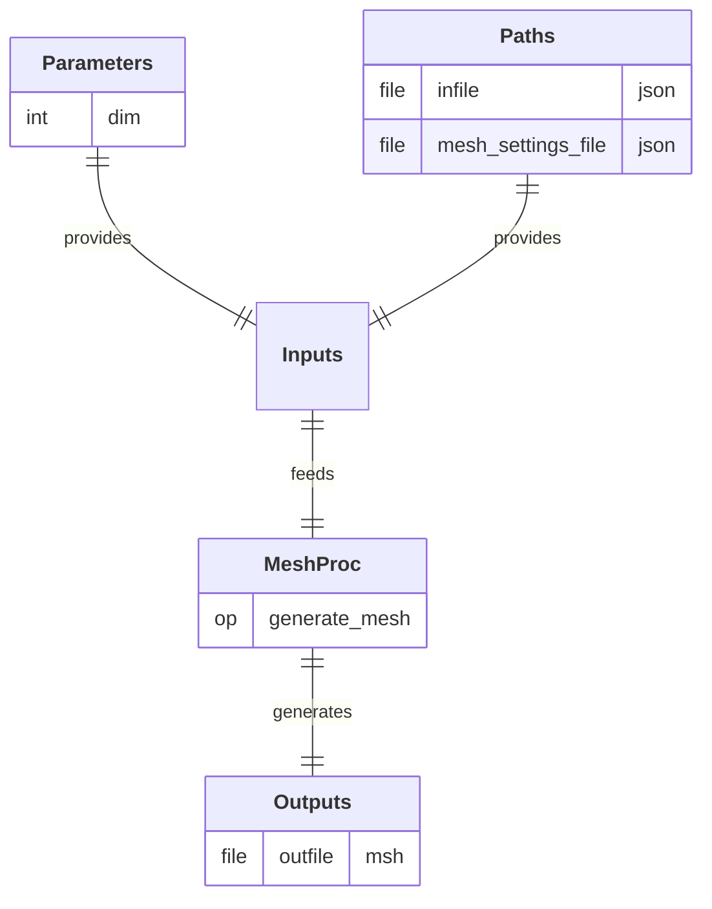

# MeshingProc

  

## Process

Discretize the geometric representation of a physical system into a computational mesh and propagate defined labels onto the mesh entities. 
A/ **`generate_mesh`:** Generate and export a computational mesh from a geometric model by discretizing the domain into mesh entities (nodes, elements) and assigning labeled physical groups.

## Input Parameter(s)

- **`dim`:** Dimension of the geometry (`1` for a 1D line, `2` for a 2D rectangle, `3` for a 3D box).

## Input Path(s)

- **`infile`:** File containing the geometric model and associated labels.
- **`mesh_settings_file`:** File containing the mesh discretization settings.

## Output Path(s)

- **`outfile`:** File containing the output mesh (exported in Gmsh format).