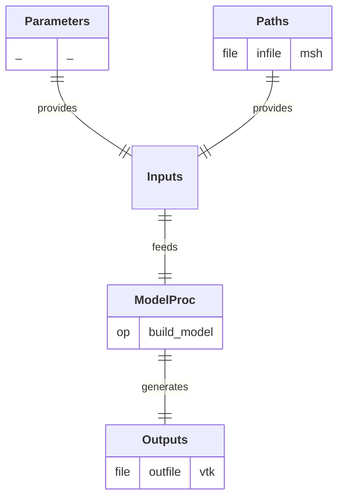

# ModelProc

  
  
  

## Process

Convert a meshed geometry into a model object mapping geometric labels to mesh entities. 
A/ **`build_model`:** Build a VTK-based model object from a meshed geometry by creating data fields that map physical groups to their corresponding nodes and elements.

## Input Parameter(s)

NA

## Input Path(s)

- **`infile`:** File containing the meshed geometry and physical group definitions (in Gmsh format).

## Output Path(s)

- **`outfile`:** File containing the model object.