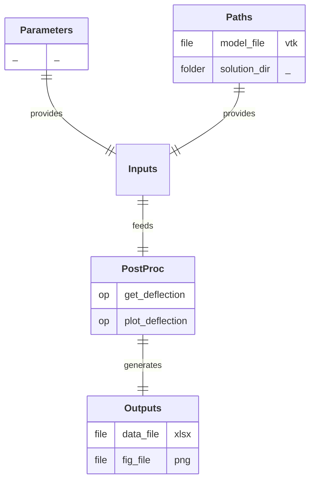

# PostProc

  

  
  
  

## Process

Post-process simulation results to extract relevant metrics. 
A/ **`get_deflection`:** Extract the displacement at the extremity of the object from raw simulation results and save it to a metric data file. 
B/ **`plot_deflection`:** Plot the displacement metric over time.

## Input Parameter(s)

NA

## Input Path(s)

- **`model_file`:** File containing the model object.
- **`solution_dir`:** Directory containing the simulation results.

## Output Path(s)

- **`data_file`:** File containing the computed displacement metric.
- **`fig_file`:** File containing the visual representation of the displacement metric.