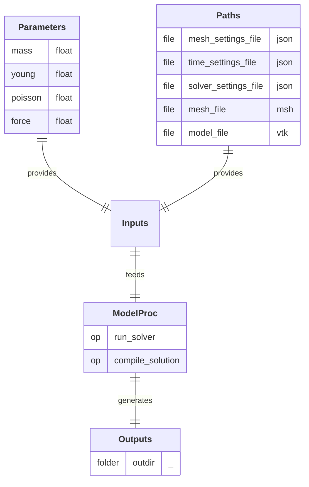

# SolverProc

  
  
  

## Process

Compute the mechanical deformation of a physical system under prescribed boundary conditions. 
A/ **`run_solver`:** Define the simulation setup, apply boundary conditions, and execute the solver to compute the raw mechanical response of the system. 
B/ **`compile_solution`:** Compile the raw simulation results into a PVD format and compute the displacement field over the model.

## Input Parameter(s)

- **`mass`:** Mass of the material.
- **`young`:** Young’s modulus of the material. 
- **`poisson`:** Poisson’s ratio of the material.
- **`force`:** Magnitude of the external force applied to the system as a boundary condition.

## Input Path(s)

- **`mesh_settings_file`:** File containing the mesh discretization settings.
- **`time_settings_file`:** File containing the time settings.
- **`solver_settings_file`:** File containing the solver settings.
- **`mesh_file`:** File containing the meshed geometry and physical group definitions (in Gmsh format).
- **`model_file`:** File containing the model object.

## Output Path(s)

- **`outdir`:** Directory containing the simulation results.